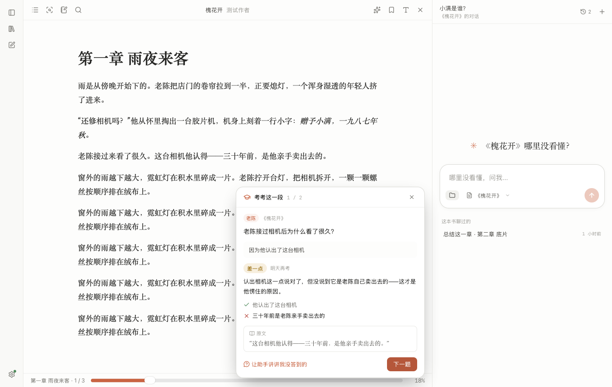
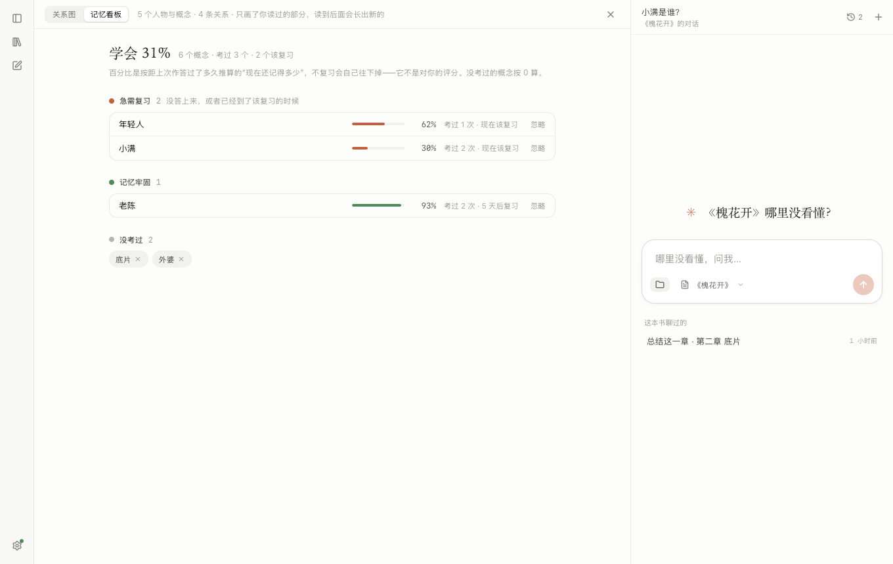
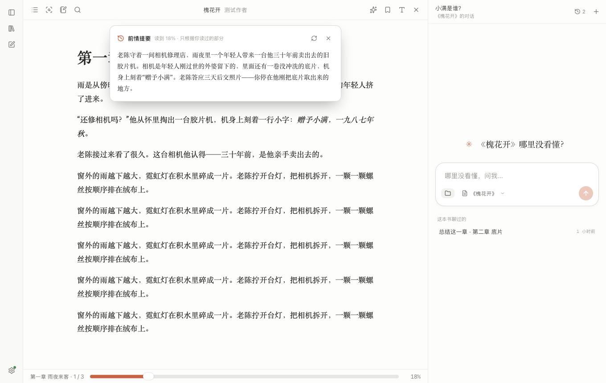

# DocAgent

**读完，真的学会。** 一个会考你的阅读器。

别的工具帮你读得更快，DocAgent 盯着你把一本书真正学会：读完一段，它主动出几道题；你用自己的话答，它对照原文批改；
每个概念掌握得怎么样它都记着，快忘的时候提醒你复习。**读了多少和学会了多少，是两个数。**



桌面应用（Tauri 2 + React + Rust），数据全在本机，模型用你自己的 API Key（DeepSeek、Kimi、智谱、Anthropic 或任何 Anthropic 兼容接口）。

> 截图里是示例数据。

## 为什么做这个

读书真正的问题不是"查不到"，而是**读完就忘、以为懂了其实没懂**。

已经有产品在认真解决这件事，比如 [Sitor](https://sitor.ai) 这类 AI 导师：把材料交给它，它拆开来讲给你听，评估过关才进下一节。
那是**导师替你读**。DocAgent 走另一条路：**你自己读原著，它在旁边考你**。

| | 导师型（AI 讲课） | DocAgent |
|---|---|---|
| 谁在读 | AI 读完讲给你听 | 你读原文，划线、写想法都在书上 |
| 考什么 | 讲过的知识点 | 你刚读完的那一段，题目自动出，不划线也考 |
| 怎么判 | 多为对话里评估，或自己点"记得 / 忘了" | 模型对照原文逐条批改，依据那一句摆给你看 |
| 数据 | 上传到云端，订阅收费 | 全在本机，开源，用你自己的 API Key |

想快速入门一个陌生领域，导师型更合适；想把一本书、一份文档、自己的笔记**真正读进去**，用这个。

```
读一段 ──→ 出题 ──→ 用自己的话答 ──→ 对照原文批改 ──→ 记掌握度 ──→ 到期复习
  ↑                                        │                │              │
  └──────── 点回原文 / 让助手讲没答到的 ←──┘                └── 掌握地图 ←─┘
```

## 学习闭环

**什么时候打断你，由助手看情况定；多久能打断一次，由规矩管着。**
代码只当传感器：在本机记下你在每一段上停了多久、各部分看没看到、往回翻了几次、划了几句、问过几次——翻过去不算读过，开着书去干别的不计时。
到了一个"决策点"（一段真读完了，或者在一段上停了正常时间的三倍），这份摘要（只有数字和概念名，不带原文）交给模型，由它结合你的掌握度和画像决定：
考几道、主动讲一讲、提醒先复习，还是什么都不做。所以它会说"这段你来回翻了三次，要不要我先讲一遍"，而不是千篇一律地弹"考你几道题"。
频率不交给模型：两次建议至少隔 10 分钟（可调），你关掉一次间隔就翻倍、接受一次恢复，一天有上限，同一段只问一次，也可以整个关掉。
对话里助手讲完一个你没弄懂的东西，也可以提出"考一道确认一下"，走的是同一张答题卡片。

**对照原文批改。** 每道题出题时就带着评分要点和一句原文里一字不差的依据；依据在原文里找不到的题直接丢掉。
批改是另一次独立的模型调用，只看题目、要点、依据和你的回答，拿不准往低了判。
哪条要点答到了、哪条没有，逐条列出来，点一下翻到原文那一句。

**没答好，让助手讲。** 一键把题、你的回答和没答到的要点交给助手，它针对你偏的地方讲，而不是把整章再复述一遍。

**掌握度会掉。** 每个概念有一份记忆状态，用 [FSRS](https://github.com/open-spaced-repetition/rs-fsrs)（Anki 现在用的算法）排下次复习：
答对的隔得越来越久，没答上来的当天再考。"学会 73%"是所有概念此刻还记得的程度的平均——不复习，它会往下走。

**复习换问法。** 到期复习不是原题重考：同一个概念换个角度再出一道（举例、比较、讲给外行听）。

**掌握地图。** 全书的概念和它们之间的关系画成一张图，按掌握度上色——记得牢、快忘了、没掌握、没考过。哪块是空白，一眼看得到。


**记忆看板。** 同一份数据的另一种看法：概念按"急需复习、衰减中、记忆牢固、没考过"分档，最该看的在最上面。
不想管的概念可以忽略——不再提醒，也不算进"学会了多少"。



**每一段学得怎么样，标在进度条上。** 阅读器底部的进度条下面有一排小段：读过的、考过的、掌握了的，颜色不一样。哪一段还是空白，不用翻目录。

**它记得你。** "我的画像"是助手对你的长期记忆，用着用着自己长出来：
对话里你提到的背景、目标、偏好，它会记下；批改时如果你的回答暴露出一个具体的误解（把甲当成了乙、因果说反了），也会记下。
之后讲解会按你的背景举例，复习那个概念时出的题会专门检验你纠正过来没有，答对了那条误解自动划掉。
每一条都带着依据，你能看、能改、能删；对助手说"别记这个"它也会删。

**你划的重点也会考。** 合上书时，这一程划下的句子会整理成复习题，和自动出的题排在同一个队列里。

**合上书有个小结。** 读了多久、往前读了多少、划了几句、答了几题、哪些排进了复习。

**书架提醒。** 首页告诉你今天该复习几个概念，几分钟一轮。每本书的卡片上有两个数：读到多少、学会多少。


## 读书这件事本身

学习闭环建在一个完整的阅读器上，不是一个附带阅读功能的聊天框。

- **透视**：让助手把整本书读一遍，给每一部分留下要点，把概念、人物和它们的关系整理出来——掌握地图上的点就是从这儿来的。
  读到一半忘了"这是什么"，选中一个名字就告诉你，每一条都能点回原文
- **前情提要**：隔了一阵再打开读到一半的书，先用几句话帮你想起讲到哪了，只用你读过的部分
- **边读边问**：选中一段直接问；助手知道你在读哪本、读到哪，问"这一章讲了什么"不用先选中
- **引用溯源**：回答里的每个结论带编号，点开就跳到原文那一处并标出来；资料里没有就明说没有，不编
- **划线和笔记**：五种颜色、三种线型，可以写想法；助手的回答能存回那段话的笔记；集中查看、跳回原文、导出 Markdown
- **直接改原文**：Markdown 和文本可以在阅读器里编辑，保存后写回原文件并重建索引——适合边学边整理自己的笔记
- **防剧透**：小说默认开——透视、关系图、助手都只用你读过的部分，也不会主动考你；资料和文档默认关
- **阅读器**：PDF / EPUB / MOBI / AZW3 / FB2 / CBZ / DOCX / Markdown / TXT 走同一个排版引擎，
  都有目录、书内搜索、书签、进度记忆、翻页或滚动、字号行距版心、四种纸色，代码块有语法上色



### 书架

- 书架上的单位是**书**：一本书可以是一个文件，也可以是一个文件夹——文件夹名是书名，里面的文件是它的各篇。
  笔记、对话、透视、掌握度都按书来
- 对话跟着书走：读书时问的问题归在这本书下面；打开一本书，右边就是它上次的对话
- 每本书可以换封面、改书名和作者、拆开、移除

### 助手

- **检索**：全文（jieba 分词 + SQLite FTS5）和语义（向量接口，可选）两路合并；不配向量接口也能用
- **检索范围**：整个书架、这本书、这一篇，或者手选几本；每段对话各记各的
- **通用能力**：和 Claude Code 同一套工具——读写本地文件、跑命令、联网搜索、派子代理，支持技能（Skill）和 MCP 服务
- **审批**：读本地位置、写文件、跑命令、联网前都会问你；工作文件夹里带的 MCP 配置和技能，第一次用要你确认
- **模型设置**：只列你配过的供应商，其它从目录里添加或者填自定义接口，各记各的 Key，可以先测试连接

## 跑起来

需要 Rust、Node 22+、pnpm、bun。目前只在 macOS（Apple 芯片）上打过包。

```bash
git clone https://github.com/happpsee/docagent.git
cd docagent
pnpm install && (cd sidecar && bun install)
(cd sidecar && bun run compile)   # 把助手进程编成单文件，约 75 MB
cp src-tauri/binaries/docagent-agent src-tauri/binaries/docagent-agent-$(rustc -vV | sed -n "s/host: //p")
pnpm tauri dev
```

首次打开在左下角的设置里添加一家模型提供商，填 API Key 和模型名。

打包：

```bash
pnpm tauri build
```

macOS 的包没有签名，首次打开要在「系统设置 → 隐私与安全性」里允许。

## 结构

```
WebView（React）  ←Tauri 命令/事件→  Rust  ←stdin/stdout JSON→  sidecar
                                      │                          （bun 单文件，内含 Agent SDK）
                                      └── SQLite + sqlite-vec          │
                                               ↑                       │
                                               └── 127.0.0.1 本地接口 ──┘
```

- **Rust**（`src-tauri/`）：文档解析与分块、存储、检索、透视、出题与批改、复习排期、管理 sidecar 进程
- **sidecar**（`sidecar/agent.ts`）：对话里的 agent 循环、工具调用、会话续接，交给 Claude Agent SDK
- **前端**（`src/`）：界面和阅读器。排版引擎是 [foliate-js](https://github.com/johnfactotum/foliate-js)（`src/vendor/foliate-js`，取自 readest 的分支）

学习相关的代码在哪：

| 做什么 | 在哪 |
|---|---|
| 出题、批改、掌握度、复习队列、易错点画像、划线出题 | `src-tauri/src/learn.rs` |
| 全书要点、概念与关系的抽取 | `src-tauri/src/xray.rs` |
| 前情提要 | `src-tauri/src/recap.rs` |
| 防剧透的界线 | `src-tauri/src/spoiler.rs` |
| 答题卡片 | `src/components/QuizSession.tsx` |
| 掌握地图、记忆看板 | `src/reader/Graph.tsx` |
| 教练：决策点上要不要打断、说什么 | `src-tauri/src/coach.rs` |
| 主动建议的频率规矩 | `src/lib/coach.ts` |
| 这一段真读过没有 | `src/reader/readTime.ts` |

出题、批改、透视、前情提要是 Rust 直接调模型接口（一次调用、要求返回 JSON、结果入库）；
只有对话走 agent。这样做的事可以测试、可以缓存，也不会因为模型多绕了几步而变慢。

## 测试

```bash
pnpm test                                   # 前端
cd src-tauri && cargo test                  # Rust：检索、书架、防剧透、透视、出题批改与排期
DOCAGENT_TEST_KEY=sk-... cargo test --test e2e -- --ignored --nocapture
```

最后一条是端到端测试，用真实模型走一遍对话的主流程：导入 → 提问带引用 → 续聊 → 文档里没有的如实说 → 审批。

## 数据去哪了

- 书、索引、对话、笔记、掌握度、设置：全在本机 `~/Library/Application Support/dev.local.docagent/`
- **出网的只有这些**：
  - 提问时，问题和检索命中的片段发给你配置的模型接口
  - 透视、出题、批改、前情提要时，那一段原文（批改时还有你的回答）发给同一个接口；合上书时，新划的句子发过去出题
  - 主动建议开着时，决策点上会发一份阅读行为的摘要（停留秒数、回翻次数、概念名和掌握度，不带原文）
  - "我的画像"里的内容会随每次提问一起发过去（画像本身只存在本机）
  - 配了向量接口的话，文档片段和检索词发给它算向量；不配就不发
- 助手读写本地文件、跑命令、访问网页前都要你点头；它的配置目录是应用自己的，不读也不写你的 `~/.claude`
- 助手保存的文件固定写到 `文稿/DocAgent/`

## 技能与 MCP 服务

配置放在 `.docagent` 目录里，分两级：

```
~/.docagent/               用户级，所有对话生效
  skills/<名字>/SKILL.md
  mcp.json
<工作文件夹>/.docagent/     文件夹级，选了这个工作文件夹时生效，同名覆盖用户级
  skills/<名字>/SKILL.md
  mcp.json
```

在输入框左下角选工作文件夹；设置里能看到已加载的技能和 MCP 服务。改完开新对话生效。

## 已知限制

- 出题和批改的质量取决于你配的模型。批改偏严是有意的；觉得判错了，可以点回原文自己对
- 复习排期用的是 FSRS 的默认参数，没有按个人的作答记录优化
- 除 DeepSeek 以外，目录里其它供应商的接口地址没有逐一实测，添加后先点"测试连接"
- 没配向量接口时检索只按字面找，同义不同词可能查不到
- 扫描版 PDF 没有文字层：能读、能加书签，但搜不到、划不了线，也出不了题
- 带 DRM 的电子书打不开
- 没有朗读、翻译、词典、云同步
- API Key 明文存在本机数据库里

## 参考过的项目

排版引擎和阅读器的功能划分来自 [readest](https://github.com/readest/readest) 和 foliate-js。
学习闭环的设计参考了这些项目和产品的做法（没有用它们的代码）：
[Sitor](https://sitor.ai)（易错点画像、记忆看板分档、划线进复习、合上书的小结）、
[engram](https://github.com/nagisanzenin/engram)（出题和批改分开、批改往低了判）、
[DeepTutor](https://github.com/HKUDS/DeepTutor)（依据必须能在原文里找到）、
[get-it](https://github.com/beltromatti/get-it)（概念图按掌握度上色）、
[FSRS](https://github.com/open-spaced-repetition)（复习排期）。

## 许可

AGPL-3.0。界面的设计系统来自 ArcReel，排版引擎是 foliate-js（MIT），详见 [NOTICE](NOTICE)。
